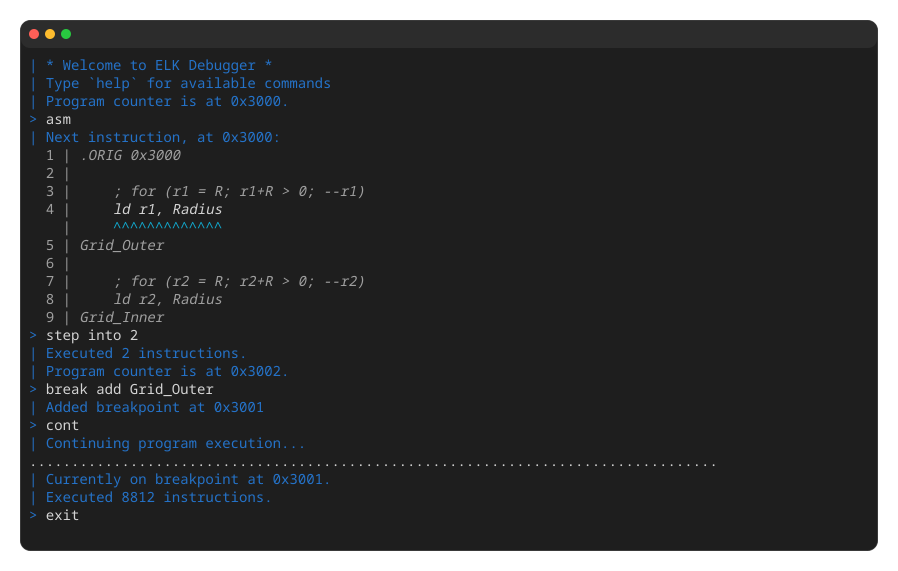
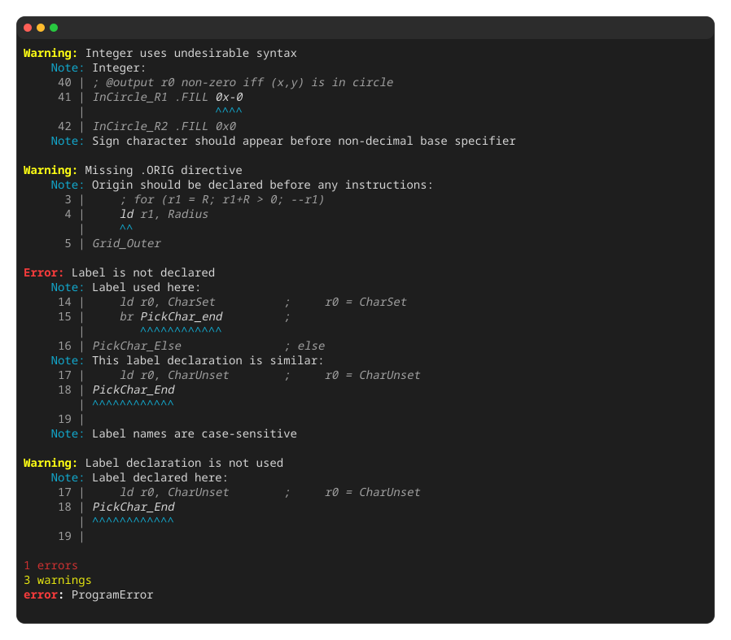

# ELK

ELK is a complete
[LC-3](https://en.wikipedia.org/wiki/Little_Computer_3) toolchain
available both as a CLI program and a [Zig](https://ziglang.org)
library.
ELK /ɛlk/ stands for **Extended LC-3 Kit**, and strives to be the most
compatible and featureful implementation available.

[Official Codeberg repository](https://codeberg.org/dxrcy/elk)
| [Documentation](https://codeberg.org/dxrcy/elk/src/branch/master/DOCS.md)
| [Releases](https://github.com/dxrcy/elk/releases)
| [GitHub mirror](https://github.com/dxrcy/elk)

<div align="center">


</div>

# Usage

> For more detailed documentation, see the [**ELK Usage Guide**](DOCS.md).

```sh
# Show all options
elk --help

# Assemble and emulate
elk hello.asm

# Assemble and debug
elk hello.asm --debug

# Assemble to object file
elk hello.asm --assemble [--output hello.obj]

# Emulate object file
elk hello.obj --emulate
```

## Quick Installation

> For more detailed installation instructions, see the
[**ELK Usage Guide**](DOCS.md#installation).

1. Download the latest binary release from
[GitHub releases](https://github.com/dxrcy/elk/releases).
2. Install the downloaded file to your PATH:

```sh
install <filename> ~/.local/bin/elk
```

## Nix

Requires [Nix](https://nixos.org/download/) with the `nix-command` and
`flakes` experimental features enabled. To enable them, add the following
line to `~/.config/nix/nix.conf`:

```ini
experimental-features = nix-command flakes
```

The flake provides packages for x86-64 and ARM64 Linux and macOS.

### User-profile installation

Install ELK for the current user:

```sh
nix profile add 'git+https://codeberg.org/dxrcy/elk.git#elk'
elk --help
```

On older Nix versions, use `nix profile install` instead of
`nix profile add`. This installation persists across shell sessions and
does not modify your NixOS or Home Manager configuration.

### Temporary shell

Start a shell with ELK available until you exit it:

```sh
nix shell 'git+https://codeberg.org/dxrcy/elk.git#elk'
elk --help
```

### NixOS configuration

Add ELK to the inputs in your existing `flake.nix`:

```nix
inputs.elk.url = "git+https://codeberg.org/dxrcy/elk.git";
```

Pass the flake inputs to your NixOS modules using `specialArgs`. For example,
adapt your existing outputs definition as follows, replacing `my-host` and
`system` with your hostname and architecture:

```nix
outputs = inputs@{ nixpkgs, ... }: {
  nixosConfigurations.my-host = nixpkgs.lib.nixosSystem {
    system = "x86_64-linux";
    specialArgs = { inherit inputs; };
    modules = [ ./configuration.nix ];
  };
};
```

In `configuration.nix`, add `inputs` to the module arguments and ELK to
your system packages:

```nix
{ inputs, pkgs, ... }:

{
  environment.systemPackages = [
    inputs.elk.packages.${pkgs.stdenv.hostPlatform.system}.default
  ];
}
```

Apply the configuration and check that ELK is available:

```sh
sudo nixos-rebuild switch --flake .#my-host
elk --help
```

Optionally, set `inputs.elk.inputs.nixpkgs.follows = "nixpkgs"` in
`flake.nix` to share your configuration's nixpkgs with ELK. Your nixpkgs
must provide `zig_0_16`; otherwise, keep ELK's own pinned nixpkgs.

# Learn More

- [Why ELK?](DOCS.md#why-elk)
- [About LC-3](DOCS.md#about-lc3)
- Setup
    - [Installation](DOCS.md#installation)
    - [Editor Integration](DOCS.md#editor-integration)
- Reference
    - [ELK Command-Line Interface](DOCS.md#elk-command-line-interface)
    - [ELK Library Features](DOCS.md#elk-library-features)
    - [ELK Extensions to LC-3](DOCS.md#elk-extensions-to-lc-3)
    - [ELK Style Guide](STYLE.md)

# Contributors

> Want to contribute? Check out the
> [open issues](https://codeberg.org/dxrcy/elk/issues?q=&sort=recentupdate&labels=1354878),
> or share your own ideas! 😀

<!-- Codeberg has no equivalent -->
<a href="https://github.com/dxrcy/elk/graphs/contributors">
    
</a>

Additional thanks to:
- [@twhlynch](https://github.com/twhlynch) for providing
    [editor integration for Neovim and
    VSCode](https://codeberg.org/dxrcy/elk/src/branch/master/DOCS.md#editor-integration).
- [@ida5428](https://github.com/ida5428) for helping with
    [Homebrew distribution](https://github.com/dxrcy/homebrew-elk).

# Usage Examples

> *Inspecting a running program with the ELK debugger*


> *Some useful diagnostics whilst compiling a faulty assembly program*

